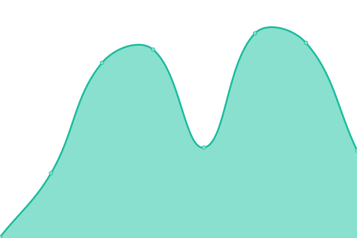

# [📈 Live Status](https://status.cjthedj97.com): <!--live status--> **🟧 Partial outage**

This repository contains the open-source uptime monitor and status page for [cjthedj97](https://status.cjthedj97.com), powered by [Upptime](https://github.com/upptime/upptime).

With [Upptime](https://upptime.js.org), you can get your own unlimited and free uptime monitor and status page, powered entirely by a GitHub repository. We use [Issues](https://github.com/cjthedj97/status.cjthedj97.com/issues) as incident reports, [Actions](https://github.com/cjthedj97/status.cjthedj97.com/actions) as uptime monitors, and [Pages](https://status.cjthedj97.com) for the status page.

<!--start: status pages-->
<!-- This summary is generated by Upptime (https://github.com/upptime/upptime) -->
<!-- Do not edit this manually, your changes will be overwritten -->
<!-- prettier-ignore -->
| URL | Status | History | Response Time | Uptime |
| --- | ------ | ------- | ------------- | ------ |
|  [Blog](https://blog.cjthedj97.me) | 🟩 Up | [blog.yml](https://github.com/cjthedj97/status.cjthedj97.com/commits/HEAD/history/blog.yml) | 

 134ms
     
 | 

<a href="https://status.cjthedj97.com/history/blog">100.00%</a>
    

|  [Portfolio](https://portfolio.cjthedj97.me) | 🟩 Up | [portfolio.yml](https://github.com/cjthedj97/status.cjthedj97.com/commits/HEAD/history/portfolio.yml) | 

 118ms
     
 | 

<a href="https://status.cjthedj97.com/history/portfolio">100.00%</a>
    

|  [Homepage](https://cjthedj97.me) | 🟩 Up | [homepage.yml](https://github.com/cjthedj97/status.cjthedj97.com/commits/HEAD/history/homepage.yml) | 

 150ms
     
 | 

<a href="https://status.cjthedj97.com/history/homepage">100.00%</a>
    

|  Teleport | 🟥 Down | [teleport.yml](https://github.com/cjthedj97/status.cjthedj97.com/commits/HEAD/history/teleport.yml) | 

 0ms
     
 | 

<a href="https://status.cjthedj97.com/history/teleport">0.00%</a>
    

|  [IP Checker](https://ip.cjthedj97.me) | 🟩 Up | [ip-checker.yml](https://github.com/cjthedj97/status.cjthedj97.com/commits/HEAD/history/ip-checker.yml) | 

 235ms
     
 | 

<a href="https://status.cjthedj97.com/history/ip-checker">100.00%</a>
    

|  Git | 🟩 Up | [git.yml](https://github.com/cjthedj97/status.cjthedj97.com/commits/HEAD/history/git.yml) | 

 603ms
     
 | 

<a href="https://status.cjthedj97.com/history/git">100.00%</a>
    

<!--end: status pages-->

[**Visit our status website →**](https://status.cjthedj97.com)

## 📄 License

- Powered by: [Upptime](https://github.com/upptime/upptime)
- Code: [MIT](./LICENSE) © [cjthedj97](https://status.cjthedj97.com)
- Data in the `./history` directory: [Open Database License](https://opendatacommons.org/licenses/odbl/1-0/)
